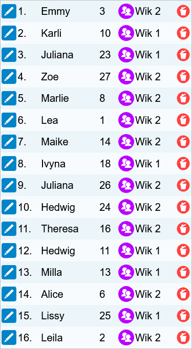
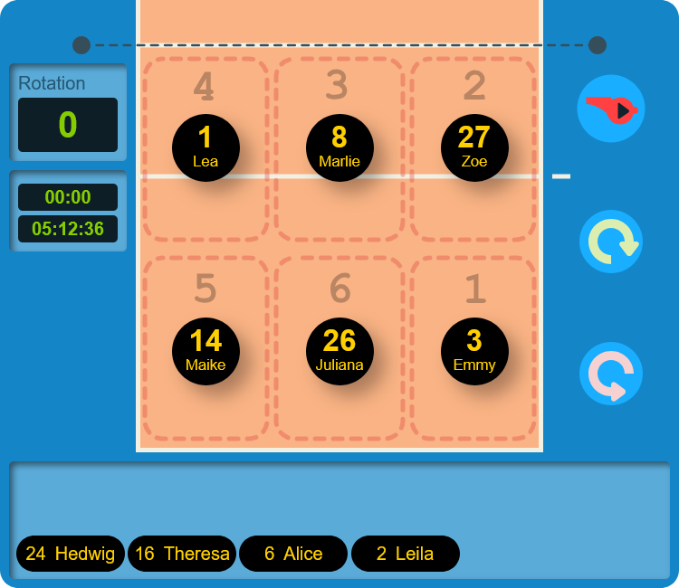
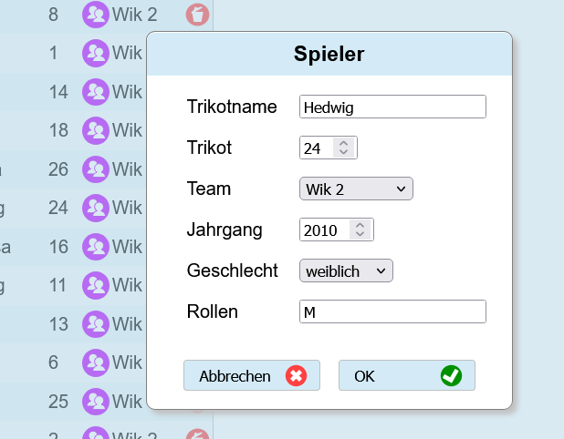

vbform version 0.5
==================

- [Idea](#idea)
- [Concepts](#concepts)
- [Screenshots](#screenshots)
- [Limitations](#current-limitations)

Little Javascript tool for managing volleyball team formations in a match.

The idea is to support the coach managing a team where the roles of the players are varying and when the team has dynamic roles (youth training).

Alpha - in progress, will be used first 2025-01-19 in a match with two teams to support the coaches controlling our formation.

## Idea

- Enter your teams
- Enter your members
- Assign members to the teams
- Edit the starting formation of a team
- or let the program do it for you by roles (not implemented)
- Start the game and rotate your formation
- Manage substitutions (not yet implemented)

## Concepts

- Static web site
- Serverless, runs in your browser completely
- Settings are stored in a cookie
- Single document
- Two views (Club and Match)
- Classic modal dialogs for editing
- drag and drop for formation managing
- MVC
- pure HTML,CSS,JavaScript,SVG

## Screenshots

## Current Limitations

- cookie solution untested (saving unsure)
- not mobile-first
- missing substitutions
- missing automatic formation setup
- missing support of 1-5 and 2-4
- no special libero support 
